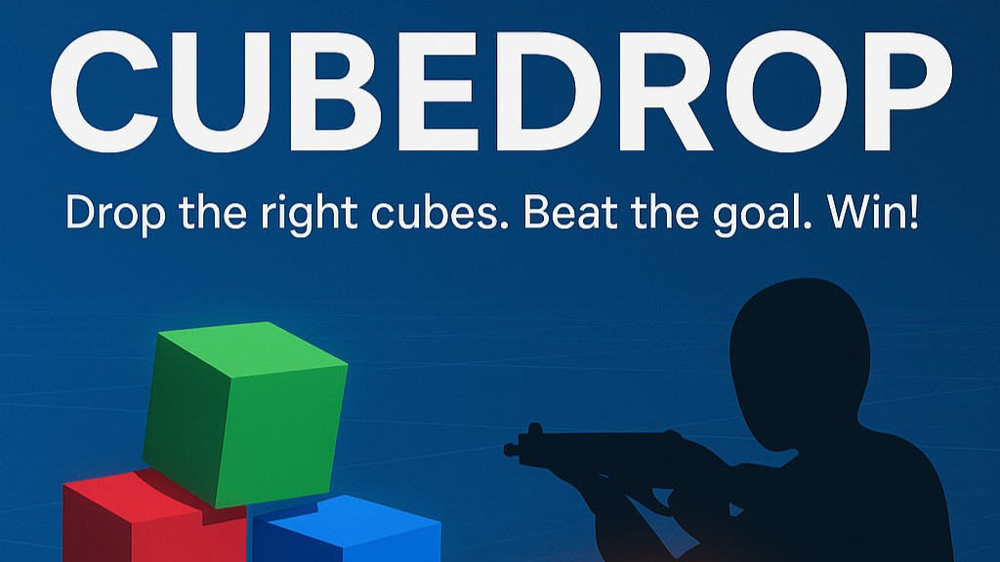

# 🧊 CubeDrop

  

A fast-paced multiplayer puzzle game built in Unity using Netcode for GameObjects (NGO).

---

## 🎮 Gameplay

- Join as Host or Client
- Move your player using **WASD + Mouse**
- Press **E** to pick up and drop colored cubes
- Complete the goal by placing the **correct number of matching cubes** into the DropBox
- First to complete the goal wins!

---

## 🔧 Tech Stack

- Unity 6.0 LTS
- Netcode for GameObjects
- TextMeshPro UI
- Rigidbody Physics + Cube Interactions

---

## ✅ Features

- Multiplayer
- Client Authority + Server RPC for secure object pickup/drop
- Smooth first-person movement
- Real-time goal fetching from API
- Win condition and cube tracking

---

## 🚀 How to Play

1. Run the game on one machine
2. Click **"Start Host"**
3. Other players click **"Join Client"**
4. Drop the required number of matching cubes or the required Colour into the DropBox to win!
